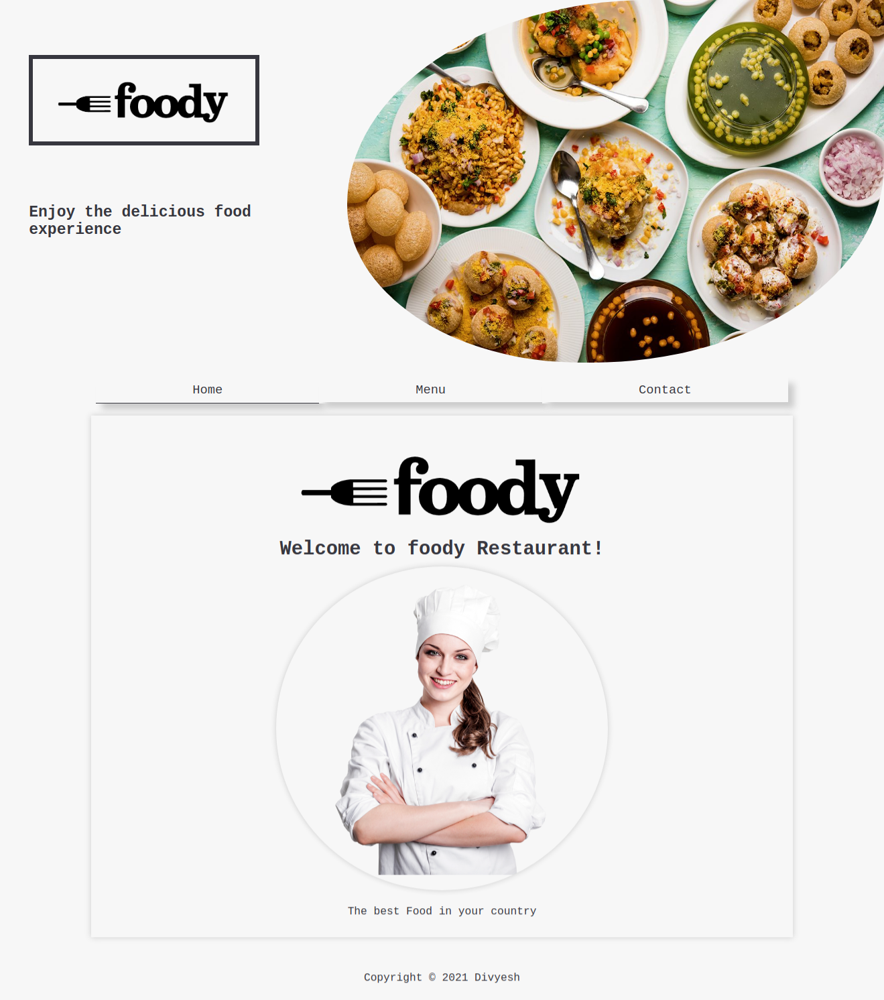

# Restaurant Page 

### Foody Restaurant Page

> A simple Restaurant website. The main goal for this website was to use DOM manipulation by dynamically rendering a simple homepage. Developed using: HTML, CSS, and Javascript.

### You can access a Live Demo [HERE](https://unruffled-ride-1dea3e.netlify.app/)

## Built With

- Javascript
- Webpack
- HTML5
- CSS3

## Getting Started

To get a local copy up and running follow these simple steps.

- [ ] Open your terminal
- [ ]  Navigate to the directory where you will like to install the repo by running `cd FOLDER-NAME` 
- [ ] Clone this repository
 > `git clone https://github.com/Div685/Restaurant-page-JS.git`
- [ ] To set webpack and dependencies run the command
  > `npm install`
 - [ ] run `index.html` file in your favorite browser.

 
## Authors

👤 **Divyesh Patel**

- GitHub: [@Div685](https://github.com/Div685)
- Twitter: [@div_685](https://twitter.com/div_685)
- LinkedIn: [Divyesh Patel](https://www.linkedin.com/in/divyesh-daxa-patel/)

## 🤝 Contributing

Contributions, issues, and feature requests are welcome!

Feel free to check the [issues page](https://github.com/Div685/Restaurant-page-JS/issues).

## Show your support

Give a ⭐️ if you like this project!